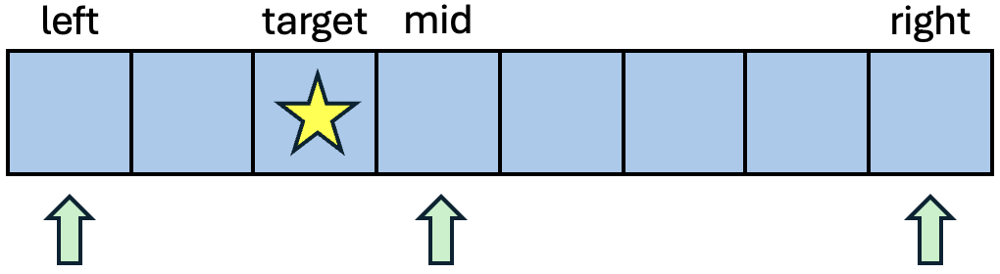
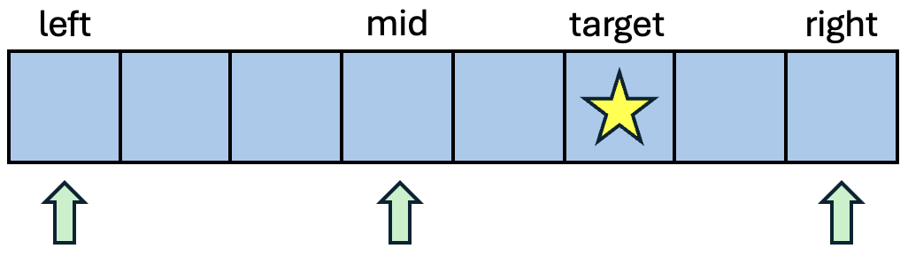

# Search:Binary Search

### 소개

> 정렬된 배열에서 탐색 범위를 절반씩 줄여가며 데이터의 위치(index)를 찾아내는 탐색 알고리즘

### 핵심 아이디어


<aside>
💡 left와 right의 mid가 target과 비교하여 left와 right를 조절한다.

</aside>

1. 탐색 범위의 왼쪽 끝(left)과 오른쪽 끝(right)을 정한다.
2. 중간값(mid = (left + right) / 2)을 확인한다. 
3. 중간값이 찾고자 하는 값(target)보다 크면, target은 왼쪽에 있으므로 right = mid - 1로 줄인다.
    
4. 중간값이 target보다 작으면, target은 오른쪽에 있으므로 left = mid + 1로 줄인다.
   
5. 값을 찾거나, 탐색 범위가 소진될 때(left > right)까지 반복한다.

### 특징

- 데이터가 정렬되어 있어야 합니다!

### 심화 / 유형

#### 1. Lower Bound & Upper Bound
> Lower Bound: target **이상**의 값이 처음으로 나타나는 위치

> Upper Bound: target **초과**의 값이 처음으로 나타나는 위치

- target과 같은 값이 없다면 두 값이 같다.
- 둘의 차이가 target의 개수를 알 수 있다.

#### 2. 파라메트릭 서치
> 최적화 문제를 결정 문제로 푸는 기법
 
- 최적화 문제: 조건을 만족하는 가장 큰 값이나 작은 값을 구하는 문제
- 결정 문제: 특정 값 X는 조건을 만족하는지 찾는 문제

  -> 정답을 직접 구하는 대신 정답을 가정하고 그 정답이 진짜 정답인지 확인한다!
  -> 정답을 가정할 때, 이분 탐색, Lower/Upper bound가 쓰인다.

### 시간복잡도

<aside>
💡 O(log N)
</aside>

- 탐색할 때마다 범위가 반으로 줄기 때문에, $log_2N$의 시간복잡도를 갖습니다.

- 순차 탐색(Linear Search)는 하나씩 순서대로 확인하기 때문에 O(N)의 시간복잡도를 갖습니다.


### 구현 코드 (Kotlin)

```kotlin
/*
arr은 정렬된 배열
target은 찾고 싶은 값
 */

fun binarySearch(arr: IntArray, target: Int): Int {
    var left = 0
    var right = arr.lastIndex
    while (left <= right) {
        val mid = left + (right - left) / 2
        when {
            arr[mid] == target -> return mid
            arr[mid] < target -> left = mid + 1
            else -> right = mid - 1
        }
    }
    return -1
}
```

### 구현 코드 (Python)

```cpp

bool binary_search(arr.begin(), arr.end(), target)

```

### 구현 코드 (C++)

```cpp

```